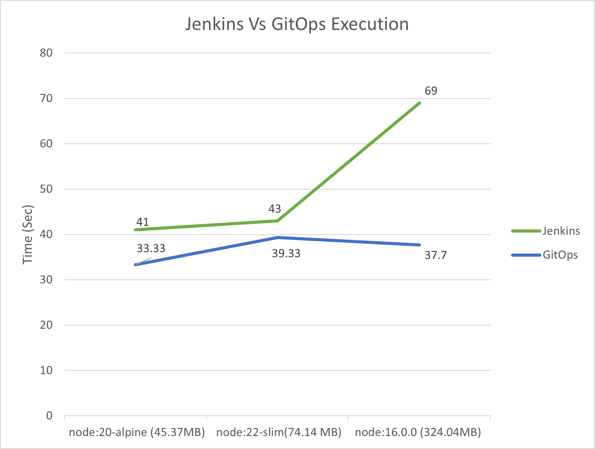

# Performance Optimization of Cloud-Native CI/CD Pipelines: A Comparative Study of GitOps and Traditional Approaches

## Overview

This project compares the performance of traditional CI/CD pipelines (using Jenkins) versus modern GitOps pipelines (using ArgoCD) in cloud-native environments. The goal is simple: **find out which approach delivers faster, more reliable, and more scalable software deployments—using real implementation and actual performance metrics.**


## Table of Contents
- [Overview](#overview)
- [Architecture Diagrams](#architecture-diagrams)
- [Tech Stack](#tech-stack)
- [Implementation](#implementation)
  - [Traditional CI/CD Pipeline (Jenkins)](#traditional-cicd-pipeline-jenkins)
  - [GitOps Pipeline (ArgoCD)](#gitops-pipeline-argocd)
- [Performance Comparison](#performance-comparison)
- [Optimization Tips](#optimization-tips)
- [Conclusion / Recommendations](#conclusion--recommendations)
- [Usage / Repo Structure](#usage--repo-structure)

## Architecture Diagrams

**Traditional CI/CD Pipeline:**


<sub>Jenkins orchestrates build, Docker image creation, pushes to registry, deploys to Kubernetes. Monitored via Prometheus & Grafana.</sub>

---

**GitOps CI/CD Pipeline:**


<sub>GitLab manages code and pipeline, ArgoCD syncs deployment state to Kubernetes. Monitoring via Prometheus & Grafana.</sub>


## Tech Stack

- **Jenkins** – Traditional CI/CD orchestration
- **ArgoCD** – GitOps-based Continuous Delivery
- **GitLab** – Source code, CI config, Docker registry
- **Docker** – Containerization
- **Kubernetes** – Orchestration & deployment
- **Helm** – Kubernetes package management
- **Prometheus** – Monitoring
- **Grafana** – Visualization


## Implementation


### Traditional CI/CD Pipeline (Jenkins)

**Step-by-step:**

1. **Repository & Code Management**  
   - Node.js app code managed in a GitLab repo.
   - Includes Dockerfile and Kubernetes YAML manifests.
2. **Provision VMs (OpenStack)**
   - Separate VMs for Jenkins, Docker, Kubernetes.
3. **Containerization**
   - Dockerfile builds app image.
   - Image pushed to GitLab Container Registry.
4. **Kubernetes Cluster Setup**
   - Cluster set up with `kubeadm`.
   - Deployment & Service YAMLs used for app rollout.
5. **Configure Jenkins Pipeline**
   - Jenkinsfile automates:  
     - Clone from GitLab  
     - Build Docker image  
     - Push image  
     - Deploy to K8s using `kubectl`
   - **Sample Jenkinsfile:**  
     ```groovy
     pipeline {
       agent any
       stages {
         stage('Checkout') { steps { /* code */ } }
         stage('Build') { steps { /* code */ } }
         stage('Push') { steps { /* code */ } }
         stage('Deploy') { steps { /* code */ } }
       }
     }
     ```
6. **Monitoring**
   - Prometheus collects metrics from Jenkins/K8s.
   - Grafana dashboards visualize pipeline execution time, resource usage.

**Diagrams:**  
- Jenkins pipeline stages (add screenshots or diagrams)
- Grafana charts (pipeline timing, resource usage)


### GitOps Pipeline (ArgoCD)

**Step-by-step:**

1. **Repository Setup**  
   - GitLab repo with code, Dockerfile, `.gitlab-ci.yml`, Kubernetes manifests/Helm charts.
2. **Provision VMs**
   - VMs for Kubernetes and ArgoCD (via OpenStack).
3. **CI Configuration (GitLab CI)**
   - `.gitlab-ci.yml` builds/pushes Docker image, updates manifests.
   - Triggers CD process.
   - **Sample `.gitlab-ci.yml`:**
     ```yaml
     stages:
       - build
       - push
     build:
       script:
         - docker build -t $CI_REGISTRY_IMAGE:$CI_COMMIT_REF_SLUG .
     push:
       script:
         - docker push $CI_REGISTRY_IMAGE:$CI_COMMIT_REF_SLUG
     ```
4. **CD via ArgoCD**
   - ArgoCD continuously syncs K8s cluster to match Git repo (declarative).
   - Rollbacks & drift correction are automatic.
   - **Diagram:** ArgoCD dashboard screenshot (add as image)
5. **Monitoring**
   - Prometheus & Grafana for real-time metrics and dashboarding.


## Performance Comparison

- **Key Metric:** Pipeline execution time (build + deploy).
- **Test:** Three Node.js base images (16.0.0, 20-alpine, 22-slim).
- **Result:**  
  - Smaller images (e.g., 20-alpine) = faster build & deployment.
  - GitOps (ArgoCD) pipeline showed better consistency and lower operational overhead than Jenkins as app complexity increased.

**Graphs:**  

<sub>(Add your performance comparison charts here)</sub>

**Summary Table:**  
| Pipeline        | Avg Time (sec) | Operational Overhead | Rollback Ease | Scalability  |
|-----------------|:--------------:|:--------------------:|:-------------:|:------------:|
| Jenkins         | 41–69          | Medium               | Manual        | OK           |
| GitOps/ArgoCD   | 35–45          | Low                  | Automatic     | Excellent    |


## Optimization Tips

- **Use minimal base images** (Node.js 20-alpine outperformed larger images)
- **Automate everything** (from build to deploy to monitoring)
- **Leverage monitoring** for fast feedback and troubleshooting (Prometheus + Grafana)
- **Store all configuration in Git** (single source of truth—reduces manual errors)
- **Use declarative manifests** for infra (Kubernetes YAML/Helm)


## Conclusion / Recommendations

- **GitOps with ArgoCD** is the way to go for modern, scalable, and reliable cloud-native CI/CD, especially when frequent deployments and easy rollbacks are needed.
- **Traditional Jenkins-based CI/CD** is still solid for simpler setups or where legacy processes/tools are required, but scaling and rollback are more manual.
- **For companies:**  
  - Migrate toward GitOps for cloud-native projects.
  - Use Jenkins if you need tons of custom plugins or have existing workflows built around it.


## Usage / Repo Structure

- `/src` – Application source code
- `/docker` – Dockerfile(s)
- `/k8s` – Kubernetes YAMLs and Helm charts
- `.gitlab-ci.yml` – GitLab pipeline config
- `Jenkinsfile` – Jenkins pipeline config
- `/monitoring` – Prometheus & Grafana setup
- `/figures` – All diagrams and charts

**To run:**  
- Follow setup instructions in `/k8s` and `/docker`
- Deploy using either Jenkins or ArgoCD instructions

---

**Questions?**  
Open an issue or contact: md._hazrat.ali@smail.th-koeln.de


# CI/CD Pipeline Implementation

This project demonstrates the implementation of a CI/CD pipeline using Kubernetes, GitLab, Helm, ArgoCD, Prometheus, and Grafana. The pipeline automates the deployment of applications in a Kubernetes cluster, with monitoring and visualization tools to ensure smooth operations.

## Overview
The pipeline automates the deployment of applications in a Kubernetes cluster, with monitoring and visualization tools to ensure smooth operations.

## Technologies Used

- **Kubernetes**: Orchestration of containerized applications.
- **Helm**: Package management for Kubernetes.
- **GitLab**: Version control and CI/CD pipeline management.
- **ArgoCD**: Continuous deployment tool for Kubernetes.
- **Prometheus**: Monitoring system for collecting metrics.
- **Grafana**: Visualization tool for metrics collected by Prometheus.


## Project Structure

- **`ansible/`**: Ansible playbooks and inventory files for automating the setup of the Kubernetes cluster and adding worker nodes.
- **`application/`**: Source code, Dockerfile, and configuration files for the application to be deployed.
- **`argocd/`**: Configuration files for ArgoCD to manage continuous deployment of the application on Kubernetes.
- **`kubernetes/`**: Scripts for setting up the Kubernetes cluster, including master and worker nodes.
- **`manifests/`**: Kubernetes manifests and Helm chart configurations for deploying the application.
- **`prometheus-grafana/`**: Setting up prometheus and grafana.
- **`.gitlab-ci.yml`**: GitLab CI/CD pipeline configuration file.

## Key Components

1. **Kubernetes Cluster**
   - Provisioned using tools like `kubeadm.
   -
   - Managed using Ansible for automated deployment and scaling.

2. **GitLab**
   - Repository for version control.
   - CI/CD pipeline configured in the `.gitlab-ci.yml` file.

3. **Helm**
   - Used for managing Kubernetes applications with Helm charts.

4. **ArgoCD**
   - Continuous deployment tool integrated with the Kubernetes cluster.
   - Automatically syncs with the GitLab repository to deploy updates.

5. **Prometheus and Grafana**
   - Prometheus collects metrics from the Kubernetes cluster.
   - Grafana visualizes these metrics for monitoring.

## Prerequisites

Before starting, ensure you have the following:

- A Kubernetes cluster with at least one master node and one worker node.
- Helm installed on your local machine.
- A GitLab repository.
- ArgoCD installed in the Kubernetes cluster.
- Prometheus and Grafana installed for monitoring.
- Access to a container registry (e.g., Docker Hub, GitLab Container Registry).

## Setup Instructions

1. **Set Up Kubernetes Cluster**
   - Provision a Kubernetes cluster with at least one master node and one worker node
   - Use `kubeadm` for provisioning.
   - Scripts are available in the kubernetes/ directory.
   - Automate setup with Ansible (`ansible/` directory).

2. **Install Helm**
   - Follow instructions in the Helm documentation to install Helm on your local machine.
     https://helm.sh/docs/intro/install/

3. **Configure GitLab Repository**
   - Set up repository and CI/CD pipeline (`.gitlab-ci.yml`).

4. **Deploy ArgoCD**
   - Install ArgoCD in the Kubernetes cluster and connect it to your GitLab repository (`argocd/` directory).
   - Scripts are available in the argocd/` directory
5. **Install Prometheus and Grafana**

   - Deploy Prometheus and Grafana using Helm to monitor your Kubernetes cluster.

## Monitoring and Management

- Access Grafana to view real-time metrics from Prometheus.
- Use ArgoCD's UI to manage and visualize application deployments.

## Automate with Ansible
Install Ansible
Install Ansible on your control machine. Ansible will be used to automate the management of your Kubernetes cluster.

1. **Set Up Ansible Inventory**
- Prepare an inventory file that lists your Kubernetes cluster nodes.
- How can we write inventory.ini file follow the (`ansible/` directory)

2. **Run Ansible Playbooks**
- Use the provided Ansible playbooks to automate the setup and management of Kubernetes components on your cluster nodes.
- How can we write ansible playbooks follow the (`ansible/` directory)


## Final Notes

This README serves as an overview of the project setup. For detailed instructions on specific components, please follow the individual `README.md` files within each directory. This project provides a robust foundation for implementing a fully automated CI/CD pipeline in a Kubernetes environment.
